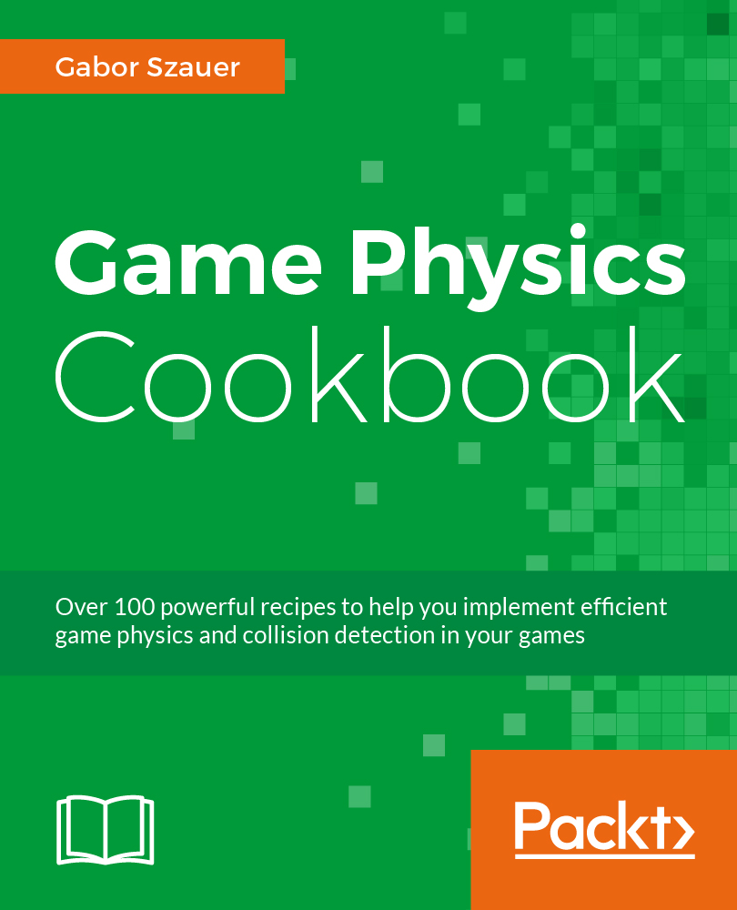

# Game Physics Cookbook

This book is a comprehensive guide to game collision detection, but only briefly touches on the topic of collision resolution (Physics). Originally this book was planned as two books:

1. Primitive Collisions Cookbook
2. Game Physics Cookbook

I was only able to write one book. This means a LOT of information had to be packed into this book. The general breakdown for the book is as follows:

* __Chapters 1, 2 and 3__    cover the basics Linear Algebra.
* __Chapters 4, 5 and 6__    cover two dimensional primitives and how to detect intersections between them. 
* __Chapters 8, 9 and 10__   cover three dimensional primitives and the most efficient way to determine intersections between them. 
* __Chapters 11, 12 and 13__ cover meshes, scenes and scene organization.
* __Chapters 14, 15 and 16__ cover physics. Throughout these three chapters we built a very basic rigid body physics engine. Even though the engine is basic; we do some interesting things with it. 

The final three chapters on physics implement particle physics, rigid body physics and soft body physics (cloth). All of these topics are used to progressivley build a rigid body physics engine troughout chapters 14, 15 and 16.

# Issues

There are various issues in the physics implementation of the source code. These issues come from the fact that the physics part of this book had to be condensed into three chapters. There was just not enough time to cover everything needed to make a robust rigid-body physics system. The biggest problem with the engine is the fact that __there is no Arbiter__. 

Without an arbiter, we can't build a sequential impulse solver. This leaves us with a rather bare-bones naive impulse solver. The problem is, impulses are solved per contact per frame. This causes excessive sliding. I've compensated for the lack of sequential impulse with linear projection and agressive friciton biasing. Older physics engines do something similar, by relying on strong handed sleeping to mask the issue. Needless to say, sleeping was not implemented.

# Future work

I still want to create a book dedicated to robust rigidbody physics. I'm also exploring various other outlets for this, perhaps a series of youtube videos or maybe even blogs. Time is the biggest factor in all of this, as of right now i have no time frame for when i could even start on this project

# Book Info

* ISBN-13: 9781787123663
* [Publisher Website](https://www.packtpub.com/game-development/game-physics-cookbook)
* [Amazon Page](https://www.amazon.com/Game-Physics-Cookbook-Gabor-Szauer-ebook/dp/B01MDLX5PH)
